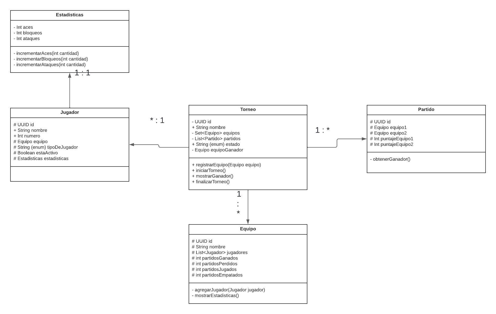

# Sistema de Torneo de Volley

Este fue un sistema desarrollado para una entrega de *Programación Orientada a Objetos* en el primer año de la carrera Analista de Sistemas en Da Vinci.

## Consignas
Desarrollar un sistema de gestión para una biblioteca digital que maneja diferentes tipos de recursos. El sistema debe permitir a los usuarios acceder a diversos materiales digitales y a los administradores gestionar el catálogo y los préstamos.

- Requerimientos del Sistema:
Equipo1
Equipo2
PuntajeEquipo1 (por set)
PuntajeEquipo2 (por set)
Estado (En curso/Finalizado)
Sets (mejor de 3)

- Estructura:
8 equipos mínimo
Cada equipo: 2 jugadores titulares, 1 suplente (opcional)
Jugadores: nombre, número, estadísticas (aces, bloqueos, ataques)
Sistema de eliminación directa
Funcionalidades:
Registro de puntos por set
Validación de reglas (sets a 21 puntos, diferencia de 2)

# Desarrollo
Desarrollado en JavaSE-22 en Eclipse IDE.

## Diagrama UML realiazdo con Lucidchart

